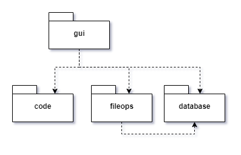
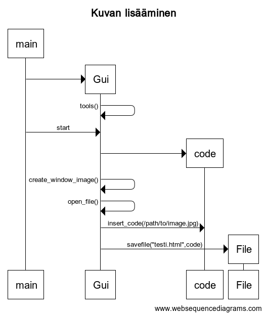

# Arkkitehtuurikuvaus

## Rakenne

Ohjelma käyttää _gui_ pakkausta käyttöliittymän toteuttamiseen, _code_ sisältää sisäisen logiikan ja _fileops_ tiedon tallentamiseen liittyvät asiat.

## Käyttöliittymä

Ohjelma sisältää graafisen käyttöliittymän. Käyttöliittymä sisältää päänäkymän, sekä päänäkymästä aukeavia ikkunoita, joita käytetään toimintojen syöttöön.

Päänäkymästä käyttäjä näkee työstettävän HTML sisällön, sekä painikkeet eri toimintojen käyttämiseen. Päänäkymän ylälaidasta löytyy pudotusvalikko ohjelman sulkemiseen, sekä tiedoston työn tallentamiseen. 

Työkalupainikkeista aukeaa työkaluun liittyvä ikkuna, kuten suoran koodin syöttäminen code-ikkunasta. (Täydennetään tähän työkalujen kuvauksia, kun niitä valmistuu)

## Sovelluslogiikka

WIP
## Toiminnot

### Kuvan lisääminen koodiin
Käyttäjä painaa GUI:sta kuvanlisäysnappia, joka avaa käyttöliittymään uuden ikkunan kuvan lisäämistä varten. Ikkunasta käyttäjä voi joko syöttää suoraan polun käsin tai käyttää selausta toimintoa ja hakea kuvan hakemistoista. Ohjelma tämän jälkeen lisää kuvan näkymään ja sallii tiedoston tallentamisen 

## Tiedon tallennus

Sovellus käyttää `fileops` luokkaa tietojen tallentamiseen. Sovellus muodostaa käyttäjän haluamalla nimellä html-tiedoston työstettävästä sisällöstä.