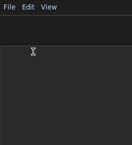
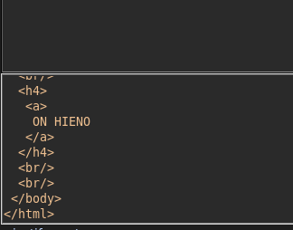
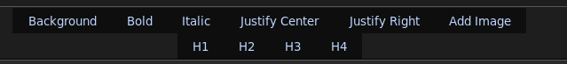

# Käyttöohje

## Asennus

Ohjelmasta löydät tuoreimman version [releaseista](https://github.com/msha/ot-harjoitustyo/releases), joista voit ladata koodin, sekä ohjelman omalle koneelle suoritettavaksi

Kun olet ladannut ohjelman koneellesi Releaseista ja purkanut sen haluttuun hakemistoon, voit käynnistää ohjelman noudattamalla seuraavia ohjeita

1. Asenna ohjelman käyttävät riippuvuudet komennolla:
```bash
poetry install
```
2. Käynnistä ohjelma komennolla:
```bash
poetry run invoke start
```

## Ohjelman käyttö

Ohjelma käynnistyy päänäkymään, josta löytyy ylälaidasta file-, edit- ja view-valikot, sekä niiden alapuolelta työkalupaletti eri ohjelman tarjoamista työkaluista. Näiden alta löytyy muokkaus-näkymä, johon käyttäjä voi suoraa kirjoittaa haluamaansa sisältöä, jonka ohjelma kääntää koodimuotoon taustalla.

## Valikot


Valikoista löytyy yleisiä ohjelman käyttöön liittyviä toimintoja. Osaa toiminnoista voi käyttää myös pikanäppäinten avulla, jotka lukevat painikkeen yhteydessä.

File -valikosta käyttäjä voi
 * Luoda uuden dokumentin `New` -toiminnolla
 * Avata olemassa olevan dokumentin `Open` -toiminnolla
 * Nähdä viimeisimmät tallennetut dokumentit `Open recent` -toiminnon kautta
 * Tallentaa dokumentin `Save` -toiminnon kautta
 * Tallentaa dokumentin uudella nimellä `Save as` -toiminnon kautta
 * Sulkea ohjelman `Exit` -toiminnon kautta

 Edit -valikosta käyttäjä voi
 * Perua tekemänsä muutoksen `Undo` painikkeen avulla
 * Tehdä uudelleen perutun muutoksen `Redo` painikkeen kautta
 
 View - valikosta käyttäjä voi kytkeä HTML koodin näytön ruudun alalaitaan `View HTML` painikkeen kautta
 

## Työkalut


* `Background` -työkalun avulla voidaan muokata dokumentin taustan väriä
* `Bold` -muuttaa tekstin lihavoiduksi/tai poistaa lihavoinnin jo lihavoidusta tekstistä
* `Italic`-muuttaa tekstin kursivoiduksi/tai poistaa kursivoinnin jo kursivoidusta tekstistä
* `Justify Center` -keskittää tekstin tai poistaa keskityksen
* `Justify Right` -tasaa tekstin oikeaan laitaan tai poistaa tasauksen
* `Add image` -työkalun avulla voidaan lisätä dokumenttiin kuvia
* `H1` -Lisää tekstiin H1 otsikon
* `H2` -Lisää tekstiin H2 otsikon
* `H3` -Lisää tekstiin H3 otsikon
* `H4` -Lisää tekstiin H4 otsikon