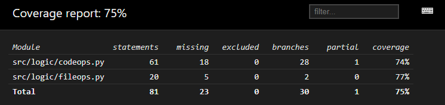

# Testit

Ohjelma on hyvin käyttöliittymäpainotteinen, eikä tkinter tarjoa erityisen hyviä automatisoituja end-to-end testausoptioita, joten testejä on tapahtunut pääosin käsin. Mukana on kuitenkin yksikkötestejä

## Yksikkötestit

Yksikkötesteillä testataan luokkia pintapuolisesti, jotta yleisimmät operaatiot onnistuvat. Luokista testaan miten parsiminen onnistuu, onko ylimääräisiä tageja ja osataanko dynaamiset muuttujat sijoittaa oikein jne.

Yksikkötesteistä on jätetty pois tietokanta- ja käyttöliittymä -luokat.

## Sovellukseen jääneitä ongelmia
* HTML sisäänluku ei toimi oikein monimutkaisilla dokumenteilla
* Tiedoston kirjoitus myös toimii pienillä varauksilla
* Koodin laatu on hieman kyseenalainen paikoittain, kun asioita piti saada tehdyksi deadlineen mennessä (huomaamattomia bugeja varmasti on)